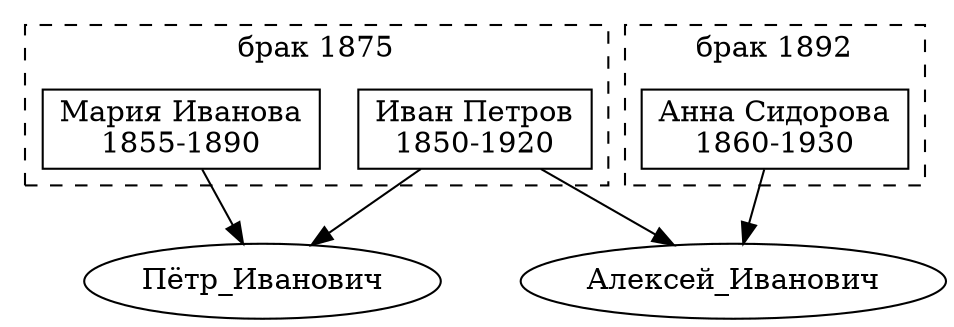
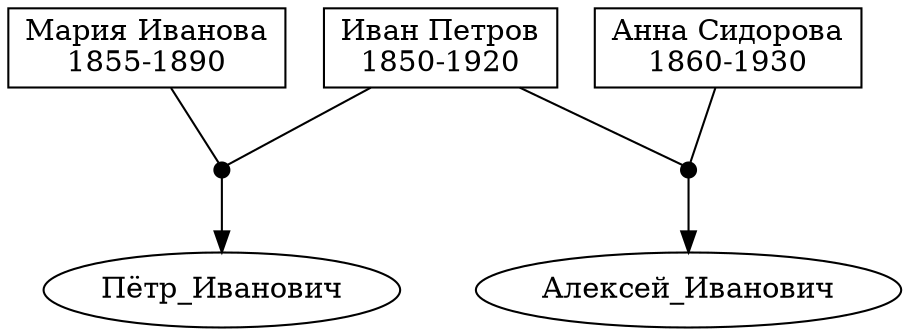
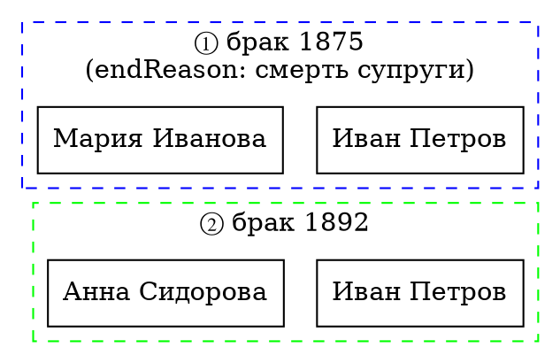

# Предлагаемые новые поля для листов person и family (v1)

Данный документ содержит предложения по добавлению новых полей в листы `person` и `family` файла `tree.xlsx`.

---

## Лист `person` — предлагаемые новые поля

| Поле | Тип | Описание |
|------|-----|----------|
| `nationality_` | отображаемое | Национальность / этническое происхождение (например: русский, немец, еврей) |
| `religion_` | отображаемое | Вероисповедание (православный, лютеранин и т.п.) |
| `occupation_` | отображаемое | Профессия / род занятий (учитель, врач, революционер) |
| `birthPlace_` | отображаемое | Место рождения (город, губерния) |
| `deathPlace_` | отображаемое | Место смерти |
| `burialPlace_` | отображаемое | Место захоронения |
| `alias_` | отображаемое | Псевдонимы / партийные клички (через `;`) |
| `note_` | отображаемое | Произвольная заметка о персоне |
| `wikidataId` | служебное | Идентификатор Wikidata (например: Q1394) — отдельно от hyperLink_ для возможности автоматической обработки |
| `wikipediaRu_` | отображаемое | Ссылка на статью в русской Википедии |

### Обоснование

- `nationality_` и `religion_` нужны для отображения в панели свойств и анализа генеалогических данных.
- `occupation_` позволяет кратко охарактеризовать персону без дополнительного источника.
- `birthPlace_` / `deathPlace_` / `burialPlace_` — важны для геолокации и отображения на карте (feature из `new_v1.md`).
- `alias_` критично для исторических персон, использовавших псевдонимы (Ленин, Сталин и пр.).
- `note_` — свободное поле для редакционных пометок.
- `wikidataId` как отдельное поле (без URL-обёртки) позволяет автоматически строить ссылки, выполнять SPARQL-запросы и обогащать данные из Wikidata.
- `wikipediaRu_` часто отличается от `hyperLink_` и заслуживает отдельного поля для удобства навигации.

---

## Лист `family` — предлагаемые новые поля

| Поле | Тип | Описание |
|------|-----|----------|
| `marriagePlace_` | отображаемое | Место венчания / заключения брака (дополняет существующее `locationM_`) |
| `endReason_` | отображаемое | Причина окончания союза: `смерть супруга`, `развод`, `неизвестно` |
| `note_` | отображаемое | Произвольная заметка о семье |
| `childrenCount` | служебное | Количество детей (числовое, для статистики) |
| `wikidataId` | служебное | Идентификатор Wikidata для семейного союза (если доступен) |

### Обоснование

- `marriagePlace_` уточняет `locationM_`: в `locationM_` уже хранится место, но для исторических данных полезно разделить место свадьбы и место жизни.
- `endReason_` позволяет отличить неполные семьи (смерть одного из супругов) от разводов, что важно для генеалогической точности.
- `note_` — свободное поле для редакторских пометок о семейном союзе.
- `childrenCount` полезен для статистической функции (средняя рождаемость по поколениям).
- `wikidataId` аналогично полю в `person` — для автоматической обработки.

---

## Пример заполнения новых полей (лист `person`)

| idA | label_ | occupation_ | birthPlace_ | alias_ | wikidataId |
|-----|--------|-------------|-------------|--------|------------|
| Ульянов_Владимир_Ильич | Ульянов Владимир Ильич | революционер, политик | Симбирск | Ленин; Старик | Q1394 |
| Ульянов_Илья_Николаевич | Ульянов Илья Николаевич | педагог, инспектор народных училищ | Астрахань | — | Q280722 |
| Бланк_Мария_Александровна | Бланк Мария Александровна | учительница | Петербург | Ульянова | Q470041 |
| Крупская_Надежда_Константиновна | Крупская Надежда Константиновна | революционер, педагог | Петербург | Рыба | Q215637 |

---

## Пример заполнения новых полей (лист `family`)

| idA | husband | wife | endReason_ | childrenCount | wikidataId |
|-----|---------|------|------------|---------------|------------|
| Ульянов_Илья_Николаевич-Бланк_Мария_Александровна | Ульянов_Илья_Николаевич | Бланк_Мария_Александровна | смерть супруга | 8 | — |
| Ульянов_Владимир_Ильич-Крупская_Надежда_Константиновна | Ульянов_Владимир_Ильич | Крупская_Надежда_Константиновна | смерть супруга | 0 | — |

---

## Визуализация персонажа с несколькими последовательными семьями

В генеалогии часто встречается ситуация, когда один человек состоял в нескольких браках последовательно (после развода или смерти супруга). Данный раздел описывает варианты визуализации таких случаев в семейном древе.

### Проблема

При стандартной визуализации семейного древа один узел персоны может быть связан с несколькими кластерами браков. Это создаёт визуальную путаницу:
- Узел персоны появляется в нескольких местах диаграммы
- Линии родства пересекаются
- Сложно понять хронологию семей

### Варианты визуализации

#### Вариант 1: Единый узел с множественными кластерами

Персона представлена одним узлом, который связан со всеми кластерами браков:



**Плюсы:** Каждая персона имеет один узел, компактное представление.
**Минусы:** При рендеринге Graphviz узел может дублироваться в каждом кластере.

#### Вариант 2: Виртуальные узлы-связки

Для каждого брака создаётся виртуальный невидимый узел, связывающий супругов:



**Плюсы:** Чёткая структура, узлы не дублируются.
**Минусы:** Дополнительные элементы на диаграмме.

#### Вариант 3: Цветовая кодировка и метки порядка

Браки одной персоны помечаются порядковыми номерами и/или разными цветами:



**Плюсы:** Визуально различимые браки, понятная хронология.
**Минусы:** Узел персоны дублируется.

### Рекомендуемый подход для tree.xlsx

В текущей реализации используется **Вариант 1** с кластерами Graphviz. Для улучшения визуализации рекомендуется:

1. **Добавить поле `marriageOrder`** в лист `family` — порядковый номер брака для данной персоны (1, 2, 3, ...)

2. **Использовать `endReason_`** для пояснения причины окончания предыдущего брака в метке кластера

3. **Сортировать кластеры по дате** при генерации DOT-кода, чтобы более ранние браки отображались выше

### Пример данных для персоны с двумя браками

**Лист `person`:**

| idA | label_ | sex | birth | death |
|-----|--------|-----|-------|-------|
| Иван_Петров | Иван Петров | М | 1850 | 1920 |
| Мария_Иванова | Мария Иванова | Ж | 1855 | 1890 |
| Анна_Сидорова | Анна Сидорова | Ж | 1860 | 1930 |
| Пётр_Иванович | Пётр Иванович | М | 1876 | 1940 |
| Алексей_Иванович | Алексей Иванович | М | 1894 | 1960 |

**Лист `family`:**

| idA | husband | wife | marriage_ | endReason_ | childrenCount_ | marriageOrder |
|-----|---------|------|-----------|------------|----------------|---------------|
| Иван_Петров-Мария_Иванова | Иван_Петров | Мария_Иванова | 1875 | смерть супруги | 2 | 1 |
| Иван_Петров-Анна_Сидорова | Иван_Петров | Анна_Сидорова | 1892 | смерть супруга | 3 | 2 |

**Дети (в листе `person`):**

| idA | hasFather | hasMother |
|-----|-----------|-----------|
| Пётр_Иванович | Иван_Петров | Мария_Иванова |
| Алексей_Иванович | Иван_Петров | Анна_Сидорова |

### Отображение в интерфейсе

При клике на узел персоны с несколькими браками в панели свойств отображается:
- Список всех семейных союзов (кнопки `foto_family` для каждого)
- Хронология браков с указанием `endReason_`

При клике на кластер брака отображаются свойства конкретного союза, включая:
- Дату брака (`marriage_`)
- Место (`locationM_`)
- Причину окончания (`endReason_`)
- Число детей (`childrenCount_`)

---

## Анализ: почему НЕ дублировать супруга в разных кластерах

### Вопрос

Почему не сделать отображение одного супруга в разных кластерах (как в Варианте 3)?

### Ответ

Дублирование узла персоны в нескольких кластерах браков **не рекомендуется** по следующим причинам:

1. **Нарушение принципа уникальности идентификатора.** В генеалогическом древе каждая персона должна быть представлена одним узлом с уникальным `idA`. Дублирование создаёт сущности `Иван_Петров_m1`, `Иван_Петров_m2`, что противоречит принципу «одна персона — один узел» и усложняет навигацию.

2. **Потеря связности графа.** При дублировании узлов теряется единая связь между родителями и детьми. Например, если у Ивана Петрова дети от двух браков, то при дублировании непонятно, какой узел (`Иван_Петров_m1` или `Иван_Петров_m2`) является «главным» для связи с предками.

3. **Увеличение размера диаграммы.** Каждый дублированный узел занимает дополнительное место, что критично для больших семейных деревьев с множеством повторных браков.

4. **Усложнение поиска и фильтрации.** При поиске персоны по имени пользователь получит несколько результатов для одного человека, что неудобно.

5. **Технические ограничения Graphviz.** При попытке поместить один узел в несколько кластеров (`subgraph cluster_*`), Graphviz либо игнорирует повторные включения, либо дублирует визуальное представление узла, что приводит к непредсказуемому поведению.

### Рекомендуемое решение

Использовать **Вариант 1** (единый узел с множественными кластерами) с дополнительными улучшениями:
- Кластеры браков отображаются рядом по горизонтали или вертикали
- Порядок кластеров определяется датой брака (`marriage_`)
- Персона визуально «принадлежит» всем своим кластерам через пунктирные границы

---

## Анализ: endReason_ в подписи кластера

### Вопрос

Нужно ли подписывать `endReason_` в кластере?

### Ответ

**Нет, `endReason_` не следует отображать в подписи кластера.** Рекомендуется оставить текущую подпись кластера — только дату брака (`marriage_`).

### Обоснование

1. **Перегрузка информацией.** Подпись кластера — это компактная метка для визуальной идентификации союза. Добавление `endReason_` делает подпись громоздкой:
   - Текущая подпись: `1875`
   - С endReason: `1875 (смерть супруги)`

   При большом количестве браков на диаграмме это значительно ухудшает читаемость.

2. **Семантическое несоответствие.** Кластер обозначает союз (брак), а не его окончание. `endReason_` логичнее отображать в панели свойств при клике на кластер, а не в визуальной метке.

3. **Избыточность.** Информация о причине окончания брака часто выводится из годов жизни супругов: если один супруг умер раньше даты следующего брака — очевидно, что причиной была смерть. Явное указание в метке дублирует информацию.

4. **Конфиденциальность.** Для некоторых семей причина расторжения брака (развод) может быть чувствительной информацией, не предназначенной для постоянного отображения на диаграмме.

### Рекомендация

- **В подписи кластера:** только дата брака (`marriage_`), например: `1875`
- **В панели свойств (при клике):** полная информация, включая `endReason_`, `marriagePlace_`, `childrenCount_`
- **При экспорте данных (JSON/CSV):** все поля, включая `endReason_`

### Пример

```dot
subgraph cluster_marriage_1 {
  label="1875";        // Только дата — компактно и читаемо
  rank=same;
  style=dashed;
  Иван_Петров;
  Мария_Иванова;
}
```

При клике на кластер в панели свойств отображается:
- Дата брака: 1875
- Место: Санкт-Петербург
- Причина окончания: смерть супруги
- Число детей: 2
