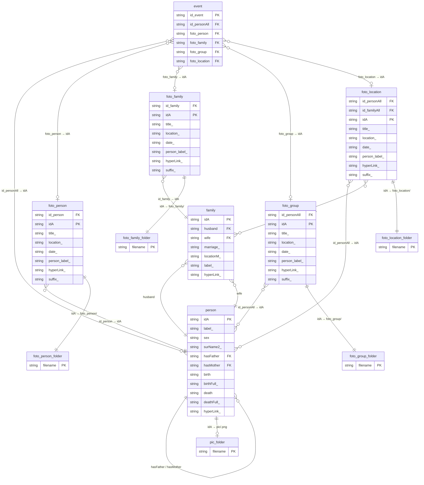
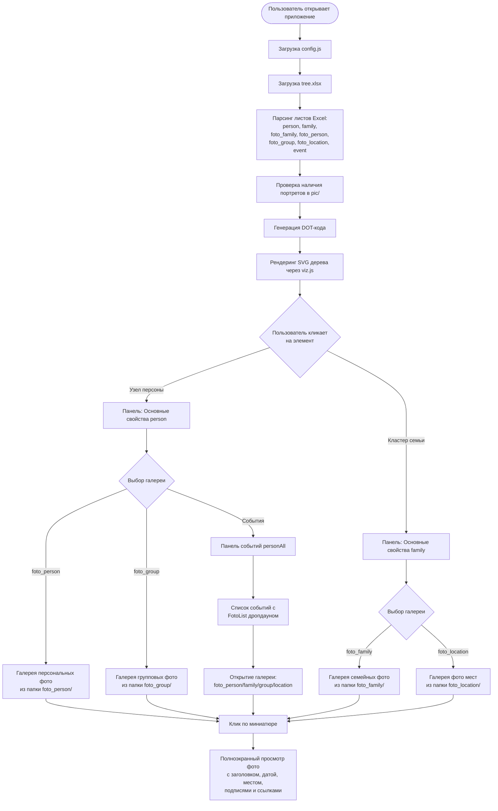

# Взаимосвязь полей Excel и папок проекта (v1)

В этом документе описано, как поля из разных листов Excel (`tree.xlsx`) связаны между собой и с папками, в которых хранятся фотографии.  
см. также [2 addition](https://github.com/bpmbpm/family-tree/blob/main/design/relationship_between_fields_and_folders_v1.md#2-addition)

---

## Листы Excel и их поля

### Лист `person`

| Поле | Тип | Описание |
|------|-----|----------|
| `idA` | ключ | Уникальный идентификатор персоны; используется как имя файла портрета (`pic/<idA>.png`) |
| `label_` | отображаемое | Имя для отображения в узле дерева |
| `sex` | служебное | Пол (М/Ж): определяет цвет узла |
| `surName2_` | отображаемое | Второй вариант фамилии (девичья и т.п.) |
| `hasFather` | ссылка → `person.idA` | idA отца (создаёт ребро в дереве) |
| `hasMother` | ссылка → `person.idA` | idA матери (создаёт ребро в дереве) |
| `birth` | служебное | Год рождения (краткий, для метки узла) |
| `birthFull_` | отображаемое | Полная дата рождения (в панели свойств) |
| `death` | служебное | Год смерти (краткий, для метки узла) |
| `deathFull_` | отображаемое | Полная дата смерти (в панели свойств) |
| `hyperLink_` | отображаемое | Ссылки (разделитель `;`) — открываются из панели свойств |

### Лист `family`

| Поле | Тип | Описание |
|------|-----|----------|
| `idA` | ключ | Уникальный идентификатор семьи |
| `husband` | ссылка → `person.idA` | idA мужа |
| `wife` | ссылка → `person.idA` | idA жены |
| `marriage_` | отображаемое | Дата свадьбы (в метке кластера и панели свойств) |
| `locationM_` | отображаемое | Место свадьбы |
| `label_` | отображаемое | Произвольная метка семьи |
| `hyperLink_` | отображаемое | Ссылки |

### Лист `foto_family`

| Поле | Тип | Описание |
|------|-----|----------|
| `id_family` | ссылка → `family.idA` | Привязка к семье |
| `idA` | ключ / имя файла | Имя файла фото в папке `foto_family/` |
| `title_` | отображаемое | Заголовок фото |
| `location_` | отображаемое | Место съёмки |
| `date_` | отображаемое | Дата съёмки |
| `person_label_` | отображаемое | Подпись людей на фото |
| `hyperLink_` | отображаемое | Ссылки |
| `suffix_` | отображаемое | Порядковый суффикс фото |

### Лист `foto_person`

| Поле | Тип | Описание |
|------|-----|----------|
| `id_person` | ссылка → `person.idA` | Привязка к персоне |
| `idA` | ключ / имя файла | Имя файла фото в папке `foto_person/` |
| `title_` | отображаемое | Заголовок фото |
| `location_` | отображаемое | Место съёмки |
| `date_` | отображаемое | Дата съёмки |
| `person_label_` | отображаемое | Подпись людей на фото |
| `hyperLink_` | отображаемое | Ссылки |
| `suffix_` | отображаемое | Порядковый суффикс фото |

### Лист `foto_group`

| Поле | Тип | Описание |
|------|-----|----------|
| `id_personAll` | ссылки → `person.idA` (через `;`) | Перечень персон, которым относится фото |
| `idA` | ключ / имя файла | Имя файла фото в папке `foto_group/` |
| `title_` | отображаемое | Заголовок фото |
| `location_` | отображаемое | Место съёмки |
| `date_` | отображаемое | Дата съёмки |
| `person_label_` | отображаемое | Подпись людей на фото |
| `hyperLink_` | отображаемое | Ссылки |
| `suffix_` | отображаемое | Порядковый суффикс фото |

### Лист `foto_location`

| Поле | Тип | Описание |
|------|-----|----------|
| `id_personAll` | ссылки → `person.idA` (через `;`) | Перечень персон, к которым относится место |
| `id_familyAll` | ссылки → `family.idA` (через `;`) | Перечень семей, к которым относится место |
| `idA` | ключ / имя файла | Имя файла фото в папке `foto_location/` |
| `title_` | отображаемое | Заголовок |
| `location_` | отображаемое | Название места |
| `date_` | отображаемое | Дата |
| `person_label_` | отображаемое | Подпись |
| `hyperLink_` | отображаемое | Ссылки |
| `suffix_` | отображаемое | Порядковый суффикс |

### Лист `event`

| Поле | Тип | Описание |
|------|-----|----------|
| `id_event` | ключ | Уникальный идентификатор события |
| `id_personAll` | ссылки → `person.idA` (через `;`) | Персоны, участвующие в событии |
| `foto_person` | ссылка → `foto_person.idA` | Фото персоны, привязанное к событию |
| `foto_family` | ссылка → `foto_family.idA` | Семейное фото события |
| `foto_group` | ссылка → `foto_group.idA` | Групповое фото события |
| `foto_location` | ссылка → `foto_location.idA` | Фото места события |
| `*_` поля | отображаемые | Произвольные поля с суффиксом `_` (заголовок, описание и т.п.) |

---

## Папки проекта и их связь с Excel

| Папка | Назначение | Связь с Excel |
|-------|-----------|---------------|
| `pic/` | Портреты для узлов дерева (миниатюры) | `person.idA` → файл `pic/<idA>.png` |
| `foto_person/` | Фотографии конкретной персоны | `foto_person.idA` → файл `foto_person/<idA>` |
| `foto_family/` | Семейные фотографии | `foto_family.idA` → файл `foto_family/<idA>` |
| `foto_group/` | Групповые фотографии нескольких персон | `foto_group.idA` → файл `foto_group/<idA>` |
| `foto_location/` | Фотографии мест, объектов, локаций | `foto_location.idA` → файл `foto_location/<idA>` |

---

## Mermaid-диаграмма взаимосвязей

---

## Схема потока данных (customer journey)

Ниже описан типичный путь пользователя при работе с приложением — от открытия до просмотра фотографий.

### Шаги пользователя (Customer Journey)

| Шаг | Действие пользователя | Результат |
|-----|----------------------|-----------|
| 1 | Открыть `index.html` (локально или с GitHub Pages) | Загружается конфиг и Excel-файл |
| 2 | Дождаться отрисовки дерева | SVG с узлами персон и кластерами семей |
| 3 | Кликнуть на узел персоны | Открывается панель «Основные свойства person» с данными и кнопками галерей |
| 4 | Нажать кнопку `foto_person` в панели | Открывается галерея миниатюр личных фотографий |
| 5 | Нажать кнопку `foto_group` в панели | Открывается галерея групповых фото, где эта персона присутствует |
| 6 | Нажать кнопку «События» | Открывается список событий персоны |
| 7 | Выбрать событие из списка | Раскрываются галереи фото, прикреплённых к событию |
| 8 | Кликнуть на кластер семьи в дереве | Открывается панель «Основные свойства family» |
| 9 | Нажать кнопку `foto_family` в панели | Открывается галерея семейных фотографий |
| 10 | Кликнуть на миниатюру | Полноэкранный просмотр фото с метаданными |
| 11 | Нажать внешнюю ссылку в панели свойств | Открывается источник (Интернет или локальный файл) в новой вкладке |

### 2 addition
Дополнения 
- в окнах События Person (кнопка Event) Есть список Foto-list (Список привязанных папок к текущему id). Можно сделать также вместо отдельных кнопок fofo_.  
При этом нужно учесть логику формирования галерей person и family, например, у person нет id_personAll у всех остальных есть, нужно единое правило отбра в "Список привязанных папок к текущему id", как вариант по id_personAll.
- можно сделать Динамический список всех фото-папок (чтобы они не были прошиты в коде). Правило добавления: сделать лист начинающийся на foto и он автоматом попадет как в список Динамический список всех фото-папок для открытия в окне, так и в список treeview foto.   
