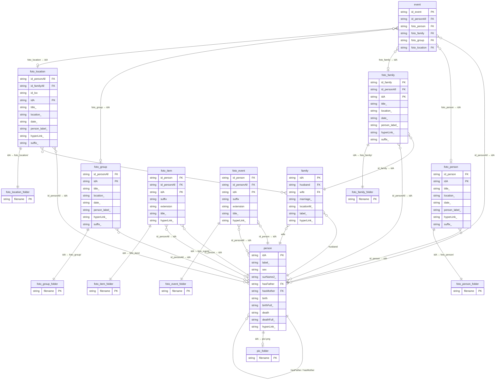
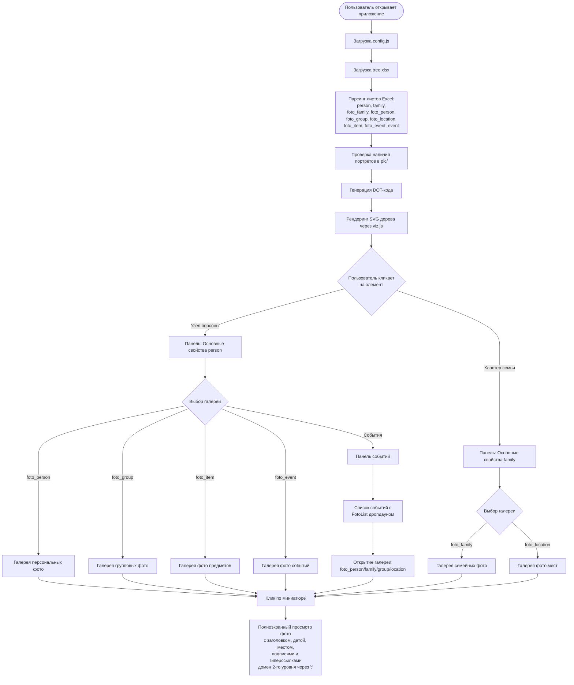

# Взаимосвязь полей Excel и папок проекта (v2)

В этом документе описано, как поля из разных листов Excel (`tree.xlsx`) связаны между собой и с папками, в которых хранятся фотографии.

> **Версия v2:** добавлены листы `foto_item` и `foto_event`, правило суффикса `_` для служебных полей,
> папки `foto_item/` и `foto_event/`, описание алгоритма ZIP и раздел про предупреждения о папках.

---

## Листы Excel и их поля

### Лист `person`

| Поле | Тип | Описание |
|------|-----|----------|
| `idA` / `idA_` | ключ | Уникальный идентификатор персоны; файл портрета `pic/<idA>.png` |
| `label_` | отображаемое | Имя для отображения в узле дерева |
| `sex` / `sex_` | служебное | Пол (М/Ж): определяет цвет узла |
| `surName2_` | отображаемое | Второй вариант фамилии |
| `hasFather` / `hasFather_` | ссылка → `person.idA` | idA отца (ребро в дереве) |
| `hasMother` / `hasMother_` | ссылка → `person.idA` | idA матери (ребро в дереве) |
| `birth` / `birth_` | служебное | Год рождения (для метки узла и сортировки) |
| `birthFull_` | отображаемое | Полная дата рождения (в панели свойств) |
| `death` / `death_` | служебное | Год смерти (для метки узла) |
| `deathFull_` | отображаемое | Полная дата смерти (в панели свойств) |
| `hyperLink_` | отображаемое | Ссылки (разделитель `;`) — показывает домен, открываются в новой вкладке |

### Лист `family`

| Поле | Тип | Описание |
|------|-----|----------|
| `idA` / `idA_` | ключ | Уникальный идентификатор семьи |
| `husband` / `husband_` | ссылка → `person.idA` | idA мужа |
| `wife` / `wife_` | ссылка → `person.idA` | idA жены |
| `marriage_` | отображаемое | Дата свадьбы (в метке кластера и панели свойств) |
| `locationM_` | отображаемое | Место свадьбы |
| `label_` | отображаемое | Произвольная метка семьи |
| `hyperLink_` | отображаемое | Ссылки |

### Лист `foto_family`

| Поле | Тип | Описание |
|------|-----|----------|
| `id_family` / `id_family_` | ссылка → `family.idA` | Привязка к семье |
| `id_personAll` / `id_personAll_` | ссылки → `person.idA` (через `;`) | Список персон на фото |
| `idA` / `idA_` | ключ / имя файла | Имя файла фото в папке `foto_family/` |
| `title_` | отображаемое | Заголовок фото |
| `location_` | отображаемое | Место съёмки |
| `date_` | отображаемое | Дата съёмки |
| `person_label_` | отображаемое | Подпись людей на фото |
| `hyperLink_` | отображаемое | Ссылки |
| `suffix_` | отображаемое | Порядковый суффикс |

### Лист `foto_person`

| Поле | Тип | Описание |
|------|-----|----------|
| `id_person` / `id_person_` | ссылка → `person.idA` | Привязка к персоне |
| `idA` / `idA_` | ключ / имя файла | Имя файла фото в папке `foto_person/` |
| `title_` | отображаемое | Заголовок фото |
| `location_` | отображаемое | Место съёмки |
| `date_` | отображаемое | Дата съёмки |
| `person_label_` | отображаемое | Подпись |
| `hyperLink_` | отображаемое | Ссылки |
| `suffix_` | отображаемое | Порядковый суффикс |

### Лист `foto_group`

| Поле | Тип | Описание |
|------|-----|----------|
| `id_personAll` / `id_personAll_` | ссылки → `person.idA` (через `;`) | Список персон |
| `idA` / `idA_` | ключ / имя файла | Имя файла фото в папке `foto_group/` |
| `title_` | отображаемое | Заголовок фото |
| `location_` | отображаемое | Место съёмки |
| `date_` | отображаемое | Дата съёмки |
| `person_label_` | отображаемое | Подпись |
| `hyperLink_` | отображаемое | Ссылки |
| `suffix_` | отображаемое | Порядковый суффикс |

### Лист `foto_location`

| Поле | Тип | Описание |
|------|-----|----------|
| `id_personAll` / `id_personAll_` | ссылки → `person.idA` (через `;`) | Список персон |
| `id_familyAll` / `id_familyAll_` | ссылки → `family.idA` (через `;`) | Список семей |
| `id_loc` / `id_loc_` | ключ локации | Идентификатор места |
| `idA` / `idA_` | ключ / имя файла | Имя файла фото в папке `foto_location/` |
| `title_` | отображаемое | Заголовок |
| `location_` | отображаемое | Название места |
| `date_` | отображаемое | Дата |
| `person_label_` | отображаемое | Подпись |
| `hyperLink_` | отображаемое | Ссылки |
| `suffix_` | отображаемое | Порядковый суффикс |

### Лист `foto_item`

| Поле | Тип | Описание |
|------|-----|----------|
| `id_person` / `id_person_` | ссылка → `person.idA` | Привязка к персоне |
| `id_personAll` / `id_personAll_` | ссылки → `person.idA` (через `;`) | Список персон (фильтр строк при парсинге) |
| `idA` / `idA_` | ключ / имя файла | Имя файла фото в папке `foto_item/` |
| `suffix` / `suffix_` | служебное | Суффикс для вычисления `idA` |
| `extension` / `extension_` | служебное | Расширение файла |
| `title_` | отображаемое | Заголовок фото |
| `hyperLink_` | отображаемое | Ссылки |

### Лист `foto_event`

| Поле | Тип | Описание |
|------|-----|----------|
| `id_person` / `id_person_` | ссылка → `person.idA` | Привязка к персоне |
| `id_personAll` / `id_personAll_` | ссылки → `person.idA` (через `;`) | Список персон (фильтр строк при парсинге) |
| `idA` / `idA_` | ключ / имя файла | Имя файла фото в папке `foto_event/` |
| `suffix` / `suffix_` | служебное | Суффикс для вычисления `idA` |
| `extension` / `extension_` | служебное | Расширение файла |
| `title_` | отображаемое | Заголовок фото |
| `hyperLink_` | отображаемое | Ссылки |

### Лист `event`

| Поле | Тип | Описание |
|------|-----|----------|
| `id_event` | ключ | Уникальный идентификатор события |
| `id_personAll` | ссылки → `person.idA` (через `;`) | Персоны, участвующие в событии |
| `foto_person` | ссылка → `foto_person.idA` | Фото персоны события |
| `foto_family` | ссылка → `foto_family.idA` | Семейное фото события |
| `foto_group` | ссылка → `foto_group.idA` | Групповое фото события |
| `foto_location` | ссылка → `foto_location.idA` | Фото места события |
| `*_` поля | отображаемые | Произвольные поля с суффиксом `_` |

---

## Папки проекта и их связь с Excel

| Папка | Назначение | Связь с Excel | В ZIP? |
|-------|-----------|---------------|--------|
| `pic/` | Портреты для узлов дерева | `person.idA` → `pic/<idA>.png` | ✅ |
| `foto_person/` | Фотографии персоны | `foto_person.idA` → `foto_person/<idA>` | ✅ |
| `foto_family/` | Семейные фотографии | `foto_family.idA` → `foto_family/<idA>` | ✅ |
| `foto_group/` | Групповые фотографии | `foto_group.idA` → `foto_group/<idA>` | ✅ |
| `foto_location/` | Фотографии мест | `foto_location.idA` → `foto_location/<idA>` | ✅ |
| `foto_item/` | Фотографии вещей | `foto_item.idA` → `foto_item/<idA>` | ✅ |
| `foto_event/` | Фотографии событий | `foto_event.idA` → `foto_event/<idA>` | ✅ |
| `album/` | Произвольный фотоальбом | — | ✅ (GitHub API или list.md) |

---

## Правило суффикса `_` — детали реализации

### Поля с `_` — «отображаемые»

Поля, заканчивающиеся на `_`, автоматически собираются в `extraFields`/`descFields` и выводятся в UI.
Код не требует явного перечисления этих полей — любое поле с `_` попадёт в интерфейс.

### Служебные поля — поддержка `поле` и `поле_`

Служебные поля (`idA`, `id_person`, `hasFather` и т.д.) участвуют в логике:
построении дерева, фильтрации, вычислении `idA`, ZIP-архивировании.

**Правило (ver6+):** при парсинге Excel-листов код принимает как `поле`, так и `поле_`.
Нормализация: служебные поля всегда доступны под именем без `_` (через `obj.idA`, а не `obj['idA_']`).

---

## Предупреждения о папках (folder-not-found warnings)

При загрузке приложения на GitHub Pages код проверяет наличие папок из `foto_sheets` через `fetch`.
Предупреждения вида:
```
⚠️ Предупреждение: папка "foto_person" из foto_sheets не найдена
```
могут появляться даже при наличии папок — GitHub Pages не возвращает `200 OK` на HEAD-запросы к директориям.
Эти предупреждения **не влияют на функциональность**: папки и их файлы доступны по прямым URL.

---

## Mermaid-диаграмма взаимосвязей



---

## Схема потока данных (Customer Journey)



### Шаги пользователя

| Шаг | Действие | Результат |
|-----|----------|-----------|
| 1 | Открыть `index.html` | Загружается конфиг и Excel |
| 2 | Дождаться отрисовки дерева | SVG с узлами и кластерами |
| 3 | Кликнуть на узел персоны | Панель «Основные свойства person» |
| 4 | Нажать кнопку галереи (`foto_person`, `foto_group` и т.д.) | Галерея миниатюр |
| 5 | Кликнуть по миниатюре | Полноэкранный просмотр с метаданными |
| 6 | Нажать `hyperLink_` в панели или окне фото | Открывается сайт (домен 2-го уровня) |
| 7 | Нажать кнопку ZIP | Создаётся архив с файлами из `fileZIP` включая `foto_item/` и `foto_event/` |
