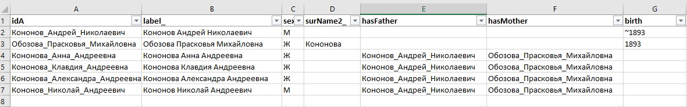
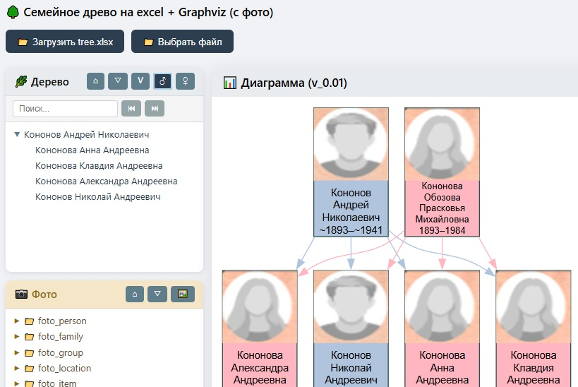
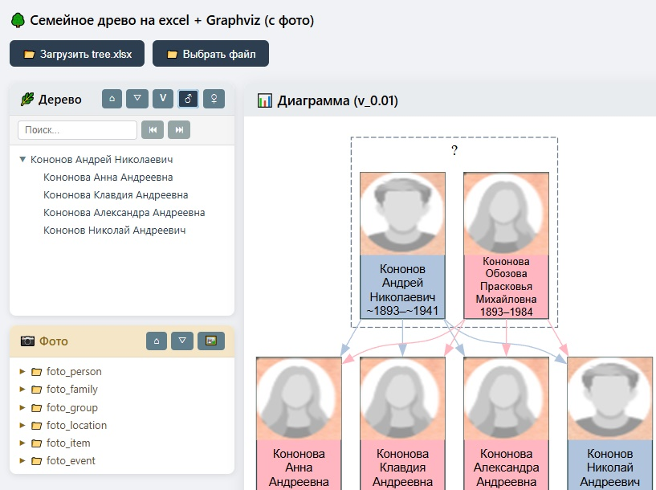
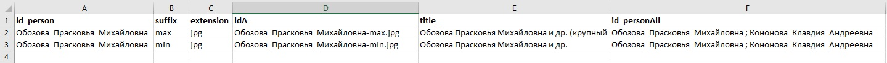
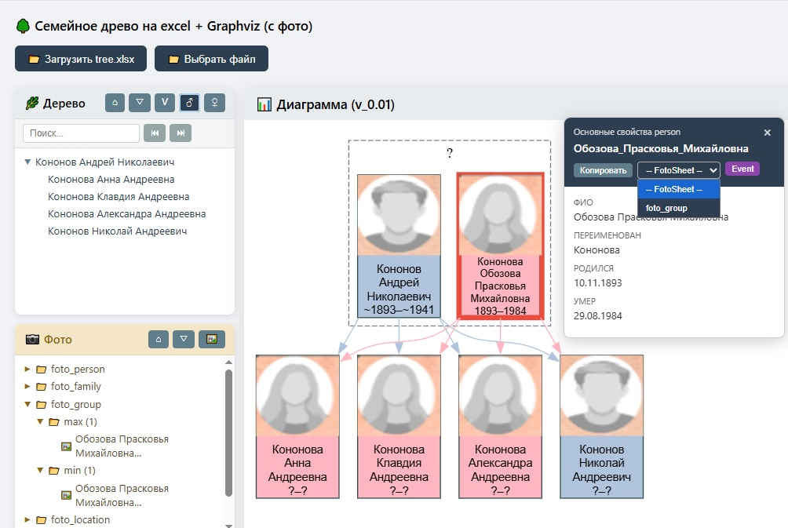

## first steps
### Начало. Вариант 1
#### Фаза А. Скачивание проекта \ шаблона
1. Заходим на старинцу: https://github.com/bpmbpm/family-tree/tree/main/ver5 (или ver6)
2. Запускаем через run: github pages https://bpmbpm.github.io/family-tree/ver5/index.html (ver6)
3. Смотрим, как должно работать ("тыкаем" в дерево, treeview и т.п., смотрим фото)
4. Кнопкой zip скачиваем и сохраняем на компьютере.  

Далее работаем в desktop версии. Запуск также через index.html (браузерный js). При запуске с desktop (с локального компьютера, а не с github pages или иного статического web server) нужно выбирать файл tree.xlsx вручную (в серверном варианте он подставляется автоматом, т.к. нет CORS) через кнопку "Выбрать файл".
### start-1-3
### Фаза Б. Составление Семейного дерева в excel
Открываем и редактируем Ecxel (tree.xlsx).    
#### 1. Лист person: 
- В поле «label_» вместо имеющегося значения вводим Новое, например, Кононов Андрей Николаевич (это будет первая персона).
- В поле idA (А = автоматически) автоматически создастся id. При добавлении новых строк следить за формулой в столбце A или руками вводить idA – заменяя пробелы на подчеркивание `_`.   
Вторую персону также вводим в поле «label_», например, Обозова Прасковья Михайловна. Вводим все имеющиеся данные (годы жизни и т.п.).  
Далее следующих персон. Должно получиться примерно следующее:  
  
Если что-то примерно известно (например, года), то ставим знак `~`.
- открываем index.html (он открывает tree.xlsx) и получаем:
-   
#### 2. Лист family:
- заполняем поля husband и wife - как id (т.е. вместо пробелов прочерк) можно копированием из полей idA листа person, но вставка "Значение".
- idA листа family формируется автоматически, т.е. id семьи будет: `Кононов_Андрей_Николаевич__Обозова_Прасковья_Михайловна` (разделитель - двойной прочерк)
- сохраняем tree.xlsx, открываем index.html и получаем:
  
  
#### 3. Лист foto_group:
- вводим данные 
  
- сохраняем tree.xlsx, 
- добавляем в папку foto_group/ групповые фотографии со сгененированными именами  
- открываем index.html и фото доступны из двух окон:
  - из карточки персоны - Основные совйства person по кнопке FotoSheet
  - из treeview Фото
  
     

Результат **start-1-3** записан в zip см. https://github.com/bpmbpm/family-tree/tree/main/ver6/old#family-tree-step1-37z

### start-4-6

#### 4 Добавим еще две персоны
4.1 Аналогично шагу 1 заполним Лист person (tree.xlsx)
Чтобы список в excel был по хронологии, то чтобы ввести добавим более старших двух персон – добавим строки на лист person, при это скопируем формулы поля idA.  
Введем Обозов Михаил Никититич и Агафья Ивановна, укажем их как hasFather и hasMother для Прасковьи Михайловны  
4.2 Аналогично шагу 2 заполним Лист family  
4.3 Cохраним файл excel (tree.xlsx) и посмотрим обновление family tree (открыть index.html, если desktop, то открыть файл вручную по кнопке «Выбрать файл»). В окне Диаграмма увидим обновленное дерево.  
#### 5 Добавим семейное фото Михаила и Агафьи
5.1 На листе foto_family файла excel сформируем id фото: скопируем с листа family id семьи и добавим произвольный суффикс, например, пустой (не заполняем). Суффикс нужен, когда большая коллекция фото одной категории – например, семейных, и желателен отбор по группам. Кроме того, фото должно иметь уникальное имя файла (обеспечивается через суффикс и расширение файла), в данном случае это: Обозов_Михаил_Никититич__Агафья_Ивановна-.jpg  
Заполняем подпись фотографии (поле title_) и при наличии иную информацию для пояснений к фото.  
Добавляем в поле id_personAll перечисление персон, указанных на фото: Обозов_Михаил_Никититич ; Агафья_Ивановна – чтобы эти фото были доступны из карточки персон (не только карточки семьи). 

5.2 Размещаем файл Обозов_Михаил_Никититич__Агафья_Ивановна-.jpg в папку foto_family.  
5.3 Теперь мы можем загруженное фото увидеть через окно treeview Фото или через карточки Семьи (клик по кластеру \ семейной паре) или через карточку Персоны (клик на персону и выбор из FotoSheet). 

#### 6 Добавить на дерево минифото
Используем встроенный сервис получения минифото для персоны с фото.    
6.1. Переходим на https://github.com/bpmbpm/family-tree/tree/main/ver6  
Далее https://github.com/bpmbpm/family-tree/tree/main/ver6#2-service_minifoto_edit  
Запускаем https://bpmbpm.github.io/family-tree/services/minifoto/minifoto_v1.html  
6.2. Выбираем файл, например, Обозов_Михаил_Никититич__Агафья_Ивановна-.jpg
Двигаем рамку захвата лица и меняем размеры рамки, стараемся получить: 
Статус: ✔ Соотношение сторон оптимально (~1:1)   
Далее нажимаем кнопку Сохранить с названием файла – как id персоны, например, Обозов_Михаил_Никититич.png. Минифото размещаем в папке pic и при обновлении html-странички на дереве будет отражена минифото.   
При задании id персоны – как имени файла минифото можно копировать по кнопке Копировать  значение id из окна Основные свойства person (карточка персоны)

Окно со всеми загруженными минифо из папки pic доступно по кнопке из панели treeview Фото.

