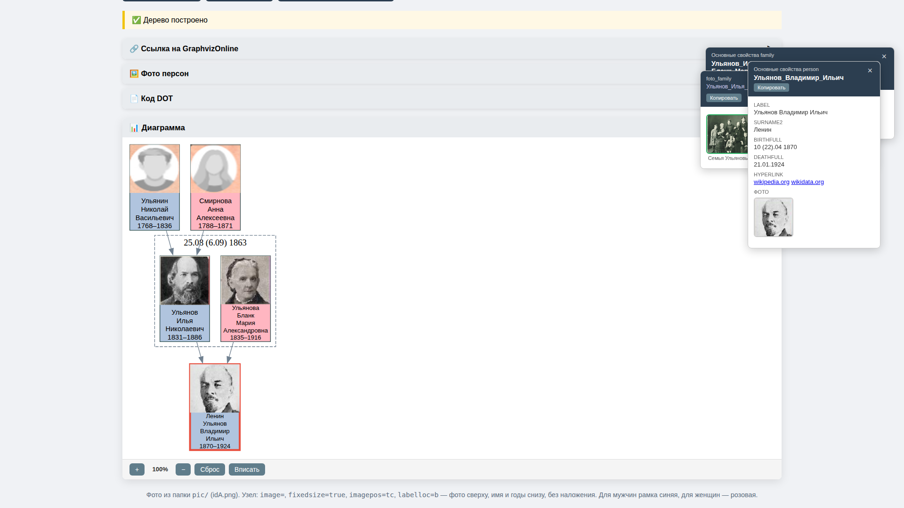
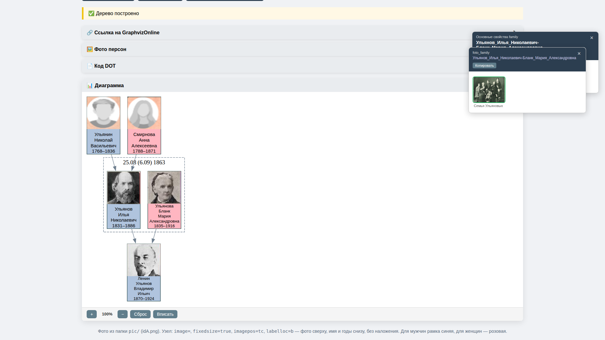
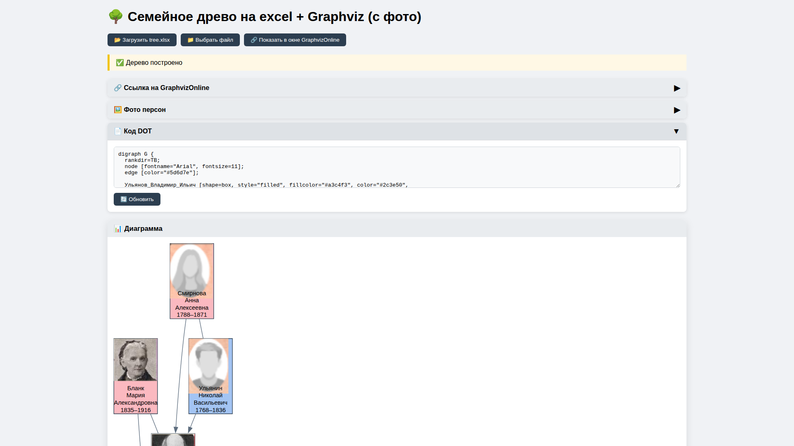
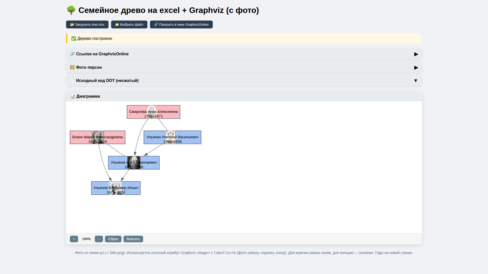
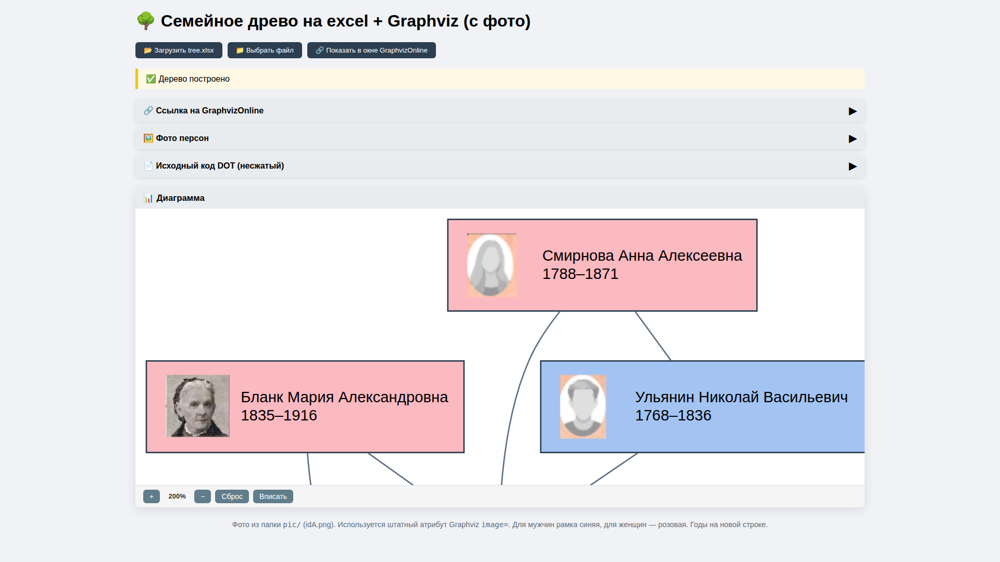

# Инструкция пользователя — Семейное древо v3

> **Версия**: 1.0
> **Дата**: 2026-03-06

## Содержание

1. [Введение](#введение)
2. [Начало работы](#начало-работы)
3. [Основной интерфейс](#основной-интерфейс)
   - [Панель инструментов](#панель-инструментов)
   - [Информационные панели](#информационные-панели)
   - [Панель дерева](#панель-дерева)
   - [Панель фото](#панель-фото)
   - [Панель диаграммы](#панель-диаграммы)
4. [Работа с данными](#работа-с-данными)
   - [Структура Excel-файла](#структура-excel-файла)
   - [Загрузка данных](#загрузка-данных)
5. [Сервисы](#сервисы)
   - [Сервис foto_folder — Проверка фотографий](#сервис-foto_folder--проверка-фотографий)
   - [Сервис minifoto — Создание миниатюр](#сервис-minifoto--создание-миниатюр)
   - [Сервис test_tree — Проверка данных](#сервис-test_tree--проверка-данных)
6. [Экспорт результатов](#экспорт-результатов)
7. [Конфигурация](#конфигурация)

---

## Введение

**Семейное древо** — это браузерное приложение для визуализации генеалогических данных. Программа позволяет:

- Загружать данные о персонах и семьях из Excel-файла (tree.xlsx)
- Строить интерактивную диаграмму родственных связей с помощью Graphviz
- Просматривать фотографии персон и семей
- Экспортировать диаграмму в PDF или ZIP-архив

### Запуск приложения

Приложение доступно онлайн:
- **Основное приложение**: https://bpmbpm.github.io/family-tree/ver5/index.html

Также можно запустить локально, открыв файл `ver5/index.html` в браузере.

---

## Начало работы

### Быстрый старт

1. Откройте приложение в браузере
2. Нажмите кнопку **📂 Загрузить tree.xlsx** для автоматической загрузки файла данных
3. Дождитесь построения диаграммы



*Рис. 1. Главный экран приложения с загруженными данными*

---

## Основной интерфейс

### Панель инструментов

В верхней части экрана расположены кнопки управления:

| Кнопка | Описание |
|--------|----------|
| **📂 Загрузить tree.xlsx** | Автоматическая загрузка файла данных из текущей директории |
| **📁 Выбрать файл** | Ручной выбор Excel-файла с диска |

### Информационные панели

Под панелью инструментов находятся сворачиваемые информационные панели:

#### 🔗 Ссылка на GraphvizOnline

Содержит сгенерированную ссылку для просмотра диаграммы в онлайн-редакторе GraphvizOnline. Ссылку можно скопировать кнопкой **📋 Копировать**.

#### 🖼️ Фото персон

Сетка миниатюрных фотографий всех персон из загруженного файла.


*Рис. 2. Панель фотографий персон*

#### 📄 Код DOT

Панель с исходным кодом диаграммы на языке DOT (Graphviz). Позволяет:

- Редактировать код вручную
- Использовать поиск и замену (Найти → Заменить → Заменить все)
- Обновить диаграмму кнопкой **🔄 Обновить**



*Рис. 3. Панель редактирования DOT-кода*

### Панель дерева

Левая колонка содержит иерархическое представление семейного древа.

**Кнопки управления:**

| Кнопка | Название | Описание |
|--------|----------|----------|
| ⌂ | Домой | Свернуть дерево в исходное состояние |
| ▽ | Раскрыть всё | Развернуть все ветки дерева |
| V | Потомки | Показать только супругу и потомков выбранной персоны |
| ♂ | Мужская линия | Строить дерево по линии отца (hasFather) |
| ♀ | Женская линия | Строить дерево по линии матери (hasMother) |

**Строка поиска:** позволяет найти персону по имени. Кнопки ⏮ и ⏭ переключают между найденными результатами.

### Панель фото

Под панелью дерева располагается панель **📷 Фото**, отображающая фотографии выбранной персоны или семьи.

### Панель диаграммы

Правая часть экрана занимает визуальная диаграмма семейного древа.

**Элементы управления:**

| Кнопка | Описание |
|--------|----------|
| **+** / **−** | Увеличить / уменьшить масштаб |
| **Сброс** | Вернуть масштаб к 100% |
| **Вписать** | Подогнать диаграмму под размер окна |
| **GraphvizOnline** | Открыть диаграмму в онлайн-редакторе |
| **pdf** | Экспортировать диаграмму в PDF |
| **zip** | Скачать архив для локального развёртывания |



*Рис. 4. Пример построенной диаграммы семейного древа*

**Взаимодействие с узлами:**
- Клик по персоне открывает панель свойств с подробной информацией
- Панели свойств можно перетаскивать и закрывать



*Рис. 5. Увеличенный вид узлов диаграммы с фотографиями*

---

## Работа с данными

### Структура Excel-файла

Файл `tree.xlsx` содержит следующие листы:

| Лист | Описание |
|------|----------|
| **person** | Список персон (idA, имя, пол, годы жизни, родители) |
| **family** | Список семей (idA, муж, жена) |
| **foto_person** | Фотографии отдельных персон |
| **foto_family** | Семейные фотографии |
| **foto_group** | Групповые фотографии |
| **foto_location** | Фотографии мест |
| **event** | События (опционально) |

#### Основные поля листа person

| Поле | Описание | Пример |
|------|----------|--------|
| idA | Уникальный идентификатор | Иванов_Иван_Иванович |
| sex | Пол (М / Ж) | М |
| birthYear | Год рождения | 1950 |
| deathYear | Год смерти | 2020 |
| hasFather | Ссылка на отца (idA) | Иванов_Пётр_Сергеевич |
| hasMother | Ссылка на мать (idA) | Иванова_Мария_Ивановна |

#### Основные поля листа family

| Поле | Описание |
|------|----------|
| idA | Уникальный идентификатор семьи |
| husband | Ссылка на мужа (idA из person) |
| wife | Ссылка на жену (idA из person) |

### Загрузка данных

1. Нажмите **📂 Загрузить tree.xlsx** для автоматической загрузки
2. Или нажмите **📁 Выбрать файл** и укажите путь к файлу Excel
3. Статус загрузки отображается под панелью инструментов

---

## Сервисы

Для работы с данными и фотографиями доступны вспомогательные сервисы.

### Сервис foto_folder — Проверка фотографий

**Назначение:** Проверка наличия файлов фотографий, указанных в Excel, и обнаружение лишних файлов в папках.

**Доступ:**
- GitHub Pages: https://bpmbpm.github.io/family-tree/ver3/service_foto_github_v2.html
- Локальный режим: `ver3/service_foto_desktop.html`

**Функции:**

1. **Проверка отсутствующих файлов** — проверяет, что все фотографии из Excel существуют в соответствующих папках:
   - `foto_person/` — фото отдельных персон
   - `foto_family/` — семейные фото
   - `foto_group/` — групповые фото
   - `foto_location/` — фото мест

2. **Проверка лишних файлов** — обнаруживает файлы в папках, не указанные в Excel

**Использование:**

1. Откройте страницу сервиса
2. При необходимости измените настройки в JSON-формате:
   ```json
   {
       "excelFile": "tree.xlsx",
       "sheets": ["foto_person", "foto_family", "foto_group", "foto_location"],
       "githubRepo": "bpmbpm/family-tree",
       "githubBranch": "main",
       "githubBasePath": "ver3"
   }
   ```
3. Нажмите **🔍 Запустить проверку** или **📁 Выбрать файл Excel**
4. Просмотрите отчёт с результатами проверки

**Результаты проверки:**
- ✅ Зелёный — все файлы на месте
- ❌ Красный — файл не найден
- ⚠️ Жёлтый — обнаружены лишние файлы

---

### Сервис minifoto — Создание миниатюр

**Назначение:** Создание миниатюрных портретных фотографий (76×74 пикселей, PNG) для отображения в узлах диаграммы.

**Доступ:** https://bpmbpm.github.io/family-tree/services/minifoto/minifoto_v1.html

**Особенности:**
- Работает полностью в браузере без сервера
- Фотографии не покидают устройство пользователя
- Поддержка настройки яркости и контраста
- Предпросмотр результата в реальном времени

**Использование:**

1. Откройте страницу сервиса
2. Нажмите **Выбрать файл** и загрузите исходную фотографию
3. На исходном изображении появится красная рамка захвата
4. Переместите и измените размер рамки, чтобы выделить нужное лицо
5. При необходимости настройте параметры:
   - **Масштаб** — приближение/отдаление
   - **Сдвиг X/Y** — точная подстройка позиции
   - **Яркость** — регулировка освещённости
   - **Контраст** — регулировка контрастности
6. Проверьте результат в окне предпросмотра (76×74 px)
7. Введите имя файла (формат: `idA_персоны.png`)
8. Нажмите **Сохранить PNG**

**Параметры миниатюры:**
- Размер: 76×74 пикселей
- Формат: PNG (RGB)
- Папка сохранения: `ver3/pic/`

---

### Сервис test_tree — Проверка данных

**Назначение:** Проверка целостности и корректности данных в файле `tree.xlsx`.

**Доступ:** `ver3/test_tree_v1.html`

**Использование:**

1. Откройте файл `test_tree_v1.html` в браузере
2. Нажмите **Загрузить tree.xlsx** или **Выбрать файл...**
3. Просмотрите результаты проверки

**Выполняемые проверки:**

| № | Проверка | Тип |
|---|----------|-----|
| 1 | Наличие листов `person` и `family` | Критическая |
| 2 | Заполненность idA в листе person | Критическая |
| 3 | Заполненность idA в листе family | Критическая |
| 4 | Ссылки husband и wife на person.idA | Критическая |
| 5 | Ссылки hasFather и hasMother на person.idA | Предупреждение |
| 6 | Уникальность idA в листе person | Критическая |
| 7 | Уникальность idA в листе family | Критическая |
| 8 | Корректность значений sex (М/Ж) | Критическая |
| 9 | Отсутствие циклических ссылок | Критическая |
| 10 | Корректность годов рождения и смерти | Критическая |
| 11-12 | Ссылки в листе foto_person | Предупреждение |
| 13-14 | Ссылки в листе foto_family | Предупреждение |
| 15-16 | Ссылки в листе foto_group | Предупреждение |
| 17-18 | Ссылки в листе foto_location | Предупреждение |
| 19-21 | Ссылки в листе event | Предупреждение |

**Формат множественных идентификаторов:**

Поля `id_personAll` и `id_familyAll` могут содержать несколько идентификаторов, разделённых точкой с запятой:

```
Иванов_Иван_Иванович; Петров_Пётр_Петрович
```

---

## Экспорт результатов

### Экспорт в PDF

1. Загрузите данные и постройте диаграмму
2. Настройте масштаб и расположение
3. Нажмите кнопку **pdf** в панели управления диаграммой
4. Сохраните сгенерированный PDF-файл

### Экспорт в ZIP-архив

Создаёт архив для автономного использования:

1. Нажмите кнопку **zip** в панели управления диаграммой
2. Скачайте архив
3. Распакуйте в любую директорию
4. Откройте `index.html` в браузере

### Экспорт в GraphvizOnline

1. Нажмите кнопку **GraphvizOnline**
2. Диаграмма откроется в онлайн-редакторе
3. При необходимости отредактируйте DOT-код
4. Экспортируйте в различные форматы (SVG, PNG, PDF)

---

## Конфигурация

Настройки приложения хранятся в файле `ver3/config.js`:

```javascript
const CONFIG = {
    // Размеры узла (в дюймах)
    "width": 2.0,
    "height": 1.83,

    // Шрифт
    "fontname": "Arial",
    "fontsize": 11,

    // Цвета
    "maleColor": "#a3c4f3",      // Цвет для мужчин
    "femaleColor": "#fbb9c0",    // Цвет для женщин
    "unknownColor": "#d5d8dc",   // Цвет при неизвестном поле

    // Путь к папке с фотографиями
    "picDir": "pic",
    "picDirType": "relative"
};
```

### Параметры конфигурации

| Параметр | Описание | По умолчанию |
|----------|----------|--------------|
| width | Ширина узла (дюймы) | 2.0 |
| height | Высота узла (дюймы) | 1.83 |
| fontname | Название шрифта | Arial |
| fontsize | Размер шрифта | 11 |
| maleColor | Цвет рамки для мужчин | #a3c4f3 |
| femaleColor | Цвет рамки для женщин | #fbb9c0 |
| picDir | Путь к папке с фото | pic |
| picDirType | Тип пути (relative/global) | relative |
| language | Язык интерфейса (ru/en/name) | ru |

---

## Полезные ссылки

- **Основное приложение**: https://bpmbpm.github.io/family-tree/ver3/index.html
- **Сервис проверки фото (GitHub)**: https://bpmbpm.github.io/family-tree/ver3/service_foto_github_v2.html
- **Сервис создания миниатюр**: https://bpmbpm.github.io/family-tree/services/minifoto/minifoto_v1.html
- **Репозиторий проекта**: https://github.com/bpmbpm/family-tree

---

*Документация актуальна для версии 3 приложения «Семейное древо».*
