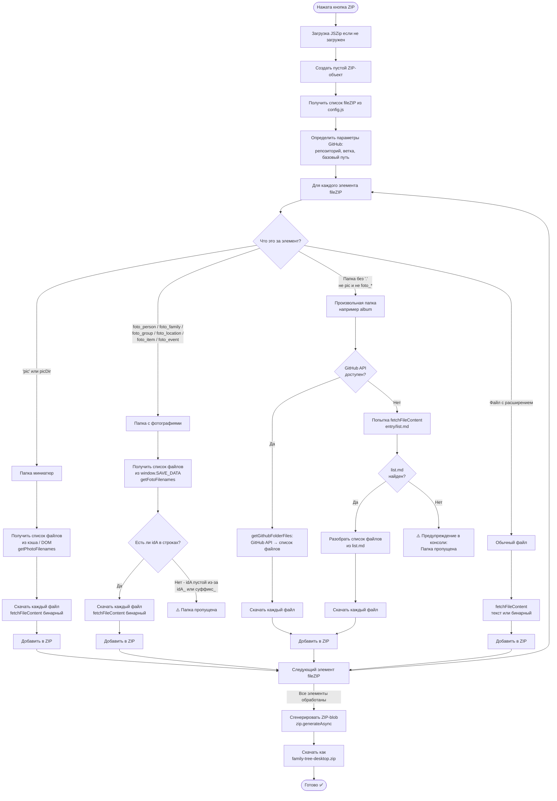

# Алгоритм создания ZIP-архива (algoritm_zip_v1)

В этом документе описан алгоритм работы кнопки **ZIP** (`downloadZip`) в `save.js`.

---

## Назначение

Кнопка **ZIP** создаёт архив `family-tree-desktop.zip`, содержащий все файлы проекта, необходимые для работы в desktop-режиме (`file://`).
Список файлов и папок задаётся в `config.js` → `fileZIP`.

---

## Два режима архивирования

| Режим | Кнопка | Как получает список файлов папки |
|-------|--------|----------------------------------|
| **GitHub Pages** | ZIP | GitHub API (автоматически) → `list.md` (запасной вариант) |
| **Desktop (file://)** | zipDesktop | Диалог выбора папки проекта пользователем |

Этот документ описывает режим **GitHub Pages** (`downloadZip`).

---

## Алгоритм `downloadZip` (Mermaid-диаграмма)



---

## Источники списка файлов по типу папки

### Папка `pic/` (портреты персон)

Список файлов получается из:
1. `window.SAVE_DATA.photoFilenames` — если заполнен после парсинга Excel
2. Иначе — из DOM: все `` с `src`, содержащим путь к `pic/`

### Папки `foto_*` (фотоархивы)

Список файлов получается из `window.SAVE_DATA` через `getFotoFilenames(dirName)`:

| Папка | Ключ в SAVE_DATA | Источник данных |
|-------|-----------------|-----------------|
| `foto_person` | `fotoPersonRows` | Лист `foto_person` → поле `idA` |
| `foto_family` | `fotoFamilyRows` | Лист `foto_family` → поле `idA` |
| `foto_group` | `fotoGroupRows` | Лист `foto_group` → поле `idA` |
| `foto_location` | `fotoLocationRows` | Лист `foto_location` → поле `idA` |
| `foto_item` | `fotoItemRows` | Лист `foto_item` → поле `idA` |
| `foto_event` | `fotoEventRows` | Лист `foto_event` → поле `idA` |

> **Важно:** если в Excel-листе поле `idA` указано как `idA_` (с суффиксом `_`),
> то `obj.idA` останется пустым → `getFotoFilenames` вернёт пустой массив →
> папка не будет добавлена в ZIP.
> **Исправление** (ver6): парсинг нормализует имена служебных полей,
> принимая как `idA`, так и `idA_`.

### Произвольные папки (например `album`)

1. **GitHub API**: `GET /repos/{owner}/{repo}/contents/{path}` → список файлов
2. **Запасной вариант**: `{entry}/list.md` — текстовый файл, каждая строка — имя файла

---

## Функция `getFotoFilenames(dirName)` — детали

```
getFotoFilenames(dirName)
  ├── Проверить window.SAVE_DATA[keyMap[dirName]]
  │     keyMap: { foto_person → fotoPersonRows, foto_family → fotoFamilyRows, ... }
  ├── Для каждой строки: если rows[i].idA — добавить в список
  └── Вернуть массив имён файлов
```

Строки `fotoItemRows` и `fotoEventRows` заполняются в `index.html → parseExcel()` при парсинге листов `foto_item` и `foto_event`. Фильтр: строки без `id_personAll` пропускаются.

---

## Связь с проблемой ZIP (sub-problem 3 из issue #110)

Причина пропуска папок `foto_item` и `foto_event` в ZIP:

1. В Excel-листе `foto_item` поле называется `idA_` (с `_`)
2. В `index.html → parseExcel()` объект строится как `obj['idA_'] = ...` → `obj.idA` не заполняется
3. `getFotoFilenames('foto_item')` проверяет `rows[i].idA` → всегда пусто
4. В ZIP добавляется 0 файлов → папка `foto_item` отсутствует в архиве

**Исправление:** в парсинге `foto_item` и `foto_event` добавлена нормализация:
служебные поля (`idA`, `id_person`, `id_personAll` и т.д.) записываются под нормализованным именем
(без суффикса `_`), даже если в заголовке Excel они указаны с `_`.
