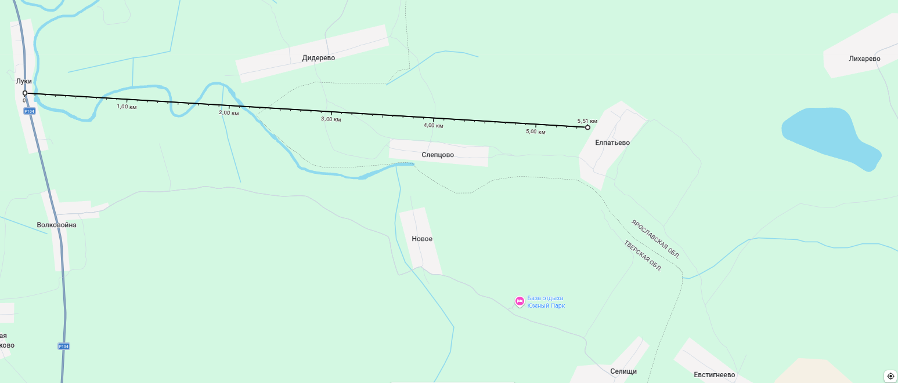

## Луки-Елпатьево
Луки (Обозовы) - Елпатьево (Кононовы) - Лихарево (Сухарниковы)
  
5,5 км по прямой

- [Луки](https://ru.wikipedia.org/wiki/%D0%9B%D1%83%D0%BA%D0%B8_(%D0%A2%D0%B2%D0%B5%D1%80%D1%81%D0%BA%D0%B0%D1%8F_%D0%BE%D0%B1%D0%BB%D0%B0%D1%81%D1%82%D1%8C) Калязинский район, Тверская область (дорога Москва-Калязин)
- [Елпатьево](https://ru.wikipedia.org/wiki/%D0%95%D0%BB%D0%BF%D0%B0%D1%82%D1%8C%D0%B5%D0%B2%D0%BE_(%D0%9F%D0%B5%D1%80%D0%B5%D1%81%D0%BB%D0%B0%D0%B2%D1%81%D0%BA%D0%B8%D0%B9_%D1%80%D0%B0%D0%B9%D0%BE%D0%BD)) Переславский район, Ярославская область. Ранее [Нагорьевский район](https://ru.ruwiki.ru/wiki/%D0%9D%D0%B0%D0%B3%D0%BE%D1%80%D1%8C%D0%B5%D0%B2%D1%81%D0%BA%D0%B8%D0%B9_%D1%80%D0%B0%D0%B9%D0%BE%D0%BD) Ивановской промышленной области

### Село Елпатьево
[Описание окружающей местности](http://www.geocaching.su/?pn=101&cid=4177)  
*"Я высунулся из кареты; лошади стояли в песке по грудь, карета - по кузов.*  
*- Черт возьми! - воскликнул я. - Кажется, пора разгрузить карету".*  
А.Дюма, "Дорога в Елпатьево"

История Елпатьево прослеживается в исторических хрониках с XVI века. Первое упоминание о селе связано с князем Димитрием Оболенским. Князья Оболенские - древний род, ведет начало от самого Рюрика. Это черниговские князья, из которых наиболее известный, наверное, Михаил Всеволодович, причисленный на Руси к лику святых (принял мученическую смерть под пытками от татар в 1246 году). Его внук Константин Юрьевич получил город Оболенск (с течением веков город опустошен, ныне это село Оболенское Жуковского р-на Калужской области); наследники князя с тех пор именовались Оболенскими. Среди них были известные военачальники, участвовавшие в сражениях против татар, поляков, ливонцев и др. Димитрий Оболенский, сын князя Федора Васильевича, тоже отличился в походах за царя, но был убит по приказу Иоанна Грозного царские псари, которые и задушили его. Это произошло в 1561 году. Был ли молодой князь владельцем Елпатьево, или то был боярин Дмитрий Иванович Оболенский-Телепнев, а может, Дмитрий Иванович Оболенский-Курлятев - этого мы наверняка не знаем. Но, как бы то ни было, известно, что Елпатьево было вотчиной князя Оболенского, и что в 1560 году владелец заложил его Троице-Сергиеву монастырю. 

В Смутное время монастырь стойко противился нападкам поляков и в 1608-09 годах держал осаду войска гетмана Яна Сапеги. Солдаты гетмана, получив контроль над Елпатьево и окрестными деревнями, "разорили и выграбили и крестьян высекли, а достальных крестьян переграбили, взяли лошадей и коров больши трехсот, а хлеб, рожь и овес, весь вывозили". Елпатьево и другие земли были переданы боярину Михаилу Вельяминову, которого Лжедмитрий II сделал владимирским воеводой. Но весной 1608 года владимирцы восстали, захватили воеводу и убили, тело же сбросили в Клязьму. 

А что же храм? Это церковь Воскресения Христова, она упоминается в начале XVII века, точнее, в 1628 году, но стояла тогда не в селе, а поодаль, на самом берегу реки. На новое место церковь перенес в 1711 году Семен Васильевич Готовцев, при Иоанне - стряпчий, позже - судья и завоеводчик (т.е. адъютант воеводы) в Крыму, а затем согласно боярским спискам "стольник отставной с 1703 г. в Москве для посылок". Стольник - придворный чин. Сначала стольники прислуживали за царским столом, но позднее становились воеводами, послами и всевозможными порученцами. По важности на Руси стольники занимали пятое место после бояр, окольничих, думных дворян и думных дьяков. Однако заметим, что в Елпатьево церковь оставалась все же деревянной. Постройка великолепного каменного храма и вообще новая яркая страница истории Елпатьево тесно связана с Нарышкиными.

Расцвет рода Нарышкиных пришелся на конец XVII века. В 1671 году красавица Наталья Кирилловна Нарышкина стала второй женой царя Алексея Михайловича. Восемь родственников Натальи Кирилловны, включая отца и трех братьев, были боярами. От этого царского брака родилось трое детей, старший из которых позднее стал известен в российской истории под именем Петра I. Камергер Павел Петрович Нарышкин, потомок одной из боковых ветвей знаменитого рода, в 1814 начал строительство каменного храма в Елпатьево. Это строительство продолжалось 15 лет. В 1829 году храм Воскресения Христова был освящен. В нем три престола, "в честь Вознесения Господня, святых апостолов Петра и Павла и святой великомученицы Параскевы". В.Даль пишет, что престол - это "столик в алтаре, перед царскими вратами, на коем совершается таинство евхаристии. В случае упразднения и снесения церкви, престол не может быть уничтожен, а обращается в часовенку". 
У сына камергера Павла Нарышкина, Дмитрия Павловича, в 1858 году гостил Александр Дюма, автор "Трех мушкетеров", когда приезжал в Россию. Гостил в Москве, на даче в Петровском парке. Нарышкин слыл любителем литературы и драматургии, а его гражданской женой была молодая французская актриса Женни Фалькон. По приглашению Нарышкина писатель отправился в поездку по его землям. В числе прочих мест они навестили Елпатьево, где провели больше недели, занимаясь для развлечения охотой на зайцев. Об этом путешествии Дюма оставил красочные заметки. Елпатьево показалось ему обустроенным (в имении был не только замечательный парк, но и роскошный ипподром: помимо театра, Нарышкин страстно увлекался лошадьми), но окружающие пространства - слишком малолюдными, а земля - богатой, но недостаточно обработанной. 

Ныне от усадьбы не осталось ничего. Отдельные вековые деревья напоминают о том, что здесь когда-то был парк. На месте ипподрома вырыли песчаный карьер, но и он сильно зарос. Воскресенский храм - громадный, но пустой; кое-где сохранились фрески, да на одной из стен маленькая табличка со словами, обращенными к случайным путникам. Неподалеку двухэтажный дом, обросший густой крапивой, с пустыми оконными дырами - то ли бывший дом священника, то ли заброшенное здание школы конца XIX века. Прямая дорога, чьей-то щедрой рукой проведенная по карте с северо-востока от деревни Лихарево, на самом деле отсутствует. Проехать в Елпатьево можно только из ближайших сел Евстигнеево и Слепцово по колдобистым проселкам; число луж не поддается подсчету. Во всем чувствуется атмосфера запустения, и лишь река Нерль со своими крутыми, поросшими сосновым лесом берегами, да широкие поля вокруг оставляют ощущение природного спокойствия этих мест.
