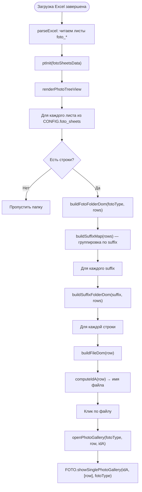

# Алгоритм работы с папками pic и album (algorithm_folder_v2)

В этом документе объясняется:
1. **Почему для папки `pic/` не нужен `list.md`**, а для папки `album/` нужен.
2. **Алгоритм формирования содержимого окна «treeview Фото»** (панель 📷 Фото).

---

## 1. Папка `pic/` — портреты персон

### Что хранится в `pic/`

Папка `pic/` содержит портреты персон в формате `<idA>.png`, где `idA` — идентификатор персоны из Excel-листа `person`.

Примеры реальных файлов:
```
pic/dafaultm.png          ← заглушка для мужчин
pic/dafaultf.png          ← заглушка для женщин
pic/Обозов_Михаил_Никититич.png
pic/Кононов_Николай_Спиридонович.png
```

### Почему `list.md` НЕ нужен для `pic/`

Список файлов `pic/` **заранее известен**: он вычисляется из данных Excel (лист `person`, поле `idA`) ещё на этапе парсинга файла.

Алгоритм работает так:

```
parseExcel(arrayBuffer)
  └─► из листа "person" для каждой записи:
        personObj.idA = row[colIdx.idA]  ← например "Обозов_Михаил_Никититич"

preloadPhotoChecks(peopleList)
  └─► для каждой персоны проверяет наличие файла "<idA>.png":
        checkPhotoExists("Обозов_Михаил_Никититич.png")
          ├─► file:// → создаёт  и слушает onload/onerror
          └─► http(s)  → fetch("<picDir>/<файл>", { method: 'HEAD' })
        результат сохраняется в: photoExistsCache["Обозов_Михаил_Никититич.png"] = true/false
```

Таким образом, при открытии окна «🖼️ Фото персон» (функция `togglePersonPhotos`) не нужно читать `list.md` — достаточно пройтись по `photoExistsCache` и отобрать существующие файлы:

```javascript
// index.html, функция togglePersonPhotos()
people.forEach(p => {
    const fn = p.idA + '.png';
    if (photoExistsCache[fn] && !existingFiles.includes(fn)) existingFiles.push(fn);
});
```

Итого: **`pic/` не требует `list.md`**, потому что:
- имена файлов однозначно выводятся из `idA` персон Excel-листа,
- наличие каждого файла проверяется через `HEAD`-запрос или `` при загрузке данных.

---

## 2. Папка `album/` — галерея альбомов

### Что хранится в `album/`

Папка `album/` хранит произвольные файлы (фото, PDF, Word, Excel, Markdown и т.д.):

```
album/Кононов-Обозов.JPG
album/album1.md
album/Test1.pdf
album/Test1.docx
album/list.md     ← индексный файл со списком содержимого
```

### Почему `list.md` НУЖЕН для `album/`

В отличие от `pic/`, содержимое папки `album/` **не связано с Excel-листом**: имена файлов произвольны и не известны заранее.

Браузер **не может читать список файлов в папке** ни через `file://`, ни через `http://` (нет прямого API для листинга директорий). Поэтому нужен внешний индекс — файл `list.md`.

### Алгоритм `showAlbumGallery()` — два источника файлов

```
showAlbumGallery()
  │
  ├─► Шаг 1: fetch("album/list.md")
  │     ├─► Успешно → разбить по строкам → fileNames[]
  │     │     Пример содержимого list.md:
  │     │       Кононов-Обозов.JPG
  │     │       album1.md
  │     │       Test1.pdf
  │     │       Test1.docx
  │     └─► Ошибка или пустой список → перейти к Шагу 2
  │
  └─► Шаг 2: GitHub API (только на GitHub Pages, если list.md пуст)
        URL: https://api.github.com/repos/<owner>/<repo>/contents/<path>/album?ref=main
        ├─► Успешно → из JSON-ответа взять имена файлов (type==="file", исключить list.md)
        └─► Ошибка → показать "Файлы не найдены в папке album/"
```

Код (упрощённо):

```javascript
// Шаг 1: list.md
const resp = await fetch('album/list.md');
if (resp.ok) {
    const text = await resp.text();
    fileNames = text.split('\n').map(l => l.trim()).filter(l => l && l !== 'list');
}

// Шаг 2: GitHub API (запасной вариант)
if (fileNames.length === 0 && window.location.protocol !== 'file:') {
    const hostname = window.location.hostname;
    if (hostname.endsWith('.github.io')) {
        const owner = hostname.replace('.github.io', '');
        const repo  = window.location.pathname.split('/')[1];
        const apiUrl = `https://api.github.com/repos/${owner}/${repo}/contents/album?ref=main`;
        const items = await (await fetch(apiUrl)).json();
        fileNames = items.filter(i => i.type === 'file' && i.name !== 'list.md').map(i => i.name);
    }
}
```

### Когда каждый источник работает

| Среда | `list.md` | GitHub API |
|-------|-----------|------------|
| `file://` (desktop) | ✅ Работает | ❌ Недоступно |
| HTTP-сервер (не GitHub) | ✅ Работает | ❌ Не применимо |
| GitHub Pages | ✅ Работает (приоритет) | ✅ Запасной вариант |

---

## 3. Сравнительная таблица: `pic/` vs `album/`

| Критерий | `pic/` | `album/` |
|----------|--------|---------|
| Именование файлов | Строго `<idA>.png` | Произвольное |
| Источник имён файлов | Excel (поле `idA`) | `list.md` или GitHub API |
| Проверка наличия | `HEAD`-запрос / `` | Не проверяется индивидуально |
| Нужен `list.md` | ❌ (имена известны из данных) | ✅ (имена неизвестны заранее) |
| `list.md` в папке | Есть, но пустой | Используется активно |

---

## 4. Алгоритм формирования «treeview Фото» (панель 📷 Фото)

Панель **📷 Фото** (правая нижняя колонка, `phototree-panel`) отображает иерархическое дерево фотоархивов из папок `foto_person`, `foto_family`, `foto_group`, `foto_location` (и опционально `foto_item`, `foto_event`).

> `list.md` **не используется** для этих папок.
> Источник данных — строки Excel-листов `foto_person`, `foto_family` и т.д.

### Источник данных

```
parseExcel(arrayBuffer)
  └─► для каждого листа foto_* читаются строки:
        fotoPersonRows   ← лист "foto_person"
        fotoFamilyRows   ← лист "foto_family"
        fotoGroupRows    ← лист "foto_group"
        fotoLocationRows ← лист "foto_location"
        fotoItemRows     ← лист "foto_item"
        fotoEventRows    ← лист "foto_event"

После загрузки данных:
ptInit(fotoSheetsData)  ← вызов из index.html, передаёт карту { имя_листа → массив_записей }
```

### Иерархия дерева (три уровня)

```
📁 foto_person                     ← папка (лист Excel)
  └─ 📂 portrait (5)               ← суффикс (поле "suffix" / "suffix_")
        └─ 🖼️ Иванов_Иван_Иванович  ← файл (значение поля "idA" или вычисляется)
  └─ 📂 event (3)
        └─ ...
📁 foto_family
  └─ ...
```

### Вычисление имени файла (`idA`)

Если в строке Excel поле `idA` заполнено (и не начинается с `=`), оно берётся как имя файла напрямую. Иначе имя вычисляется по формуле:

```
idA = <id_*> + "-" + <suffix> + "." + <extension>
```

Например:
```
id_person = "Иванов_Иван_Иванович"
suffix    = "portrait"
extension = "jpg"
→ idA = "Иванов_Иван_Иванович-portrait.jpg"
```

Код (`phototree.js`, функция `computeIdA`):

```javascript
function computeIdA(row, idField, suffixField) {
    if (row.idA && !row.idA.toString().startsWith('=')) {
        return row.idA.toString().trim();      // ← поле idA заполнено
    }
    const idVal  = row[idField]     || '';     // id_person / id_family / id_loc
    const suffix = row[suffixField] || row['suffix'] || row['suffix_'] || '';
    const ext    = row['extension'] || 'jpg';
    if (idVal && suffix && ext) {
        return `${idVal}-${suffix}.${ext}`;    // ← вычисляем
    }
    return idVal.toString().trim() || '(без имени)';
}
```

### Поля идентификатора и суффикса по типу папки

| Лист / Папка | Поле ID | Поле суффикса |
|--------------|---------|---------------|
| `foto_person` | `id_person` | `suffix` |
| `foto_family` | `id_family` | `suffix_` |
| `foto_group` | `id_person` | `suffix` |
| `foto_location` | `id_loc` | `suffix` |
| `foto_item` | `id_person` | `suffix` |
| `foto_event` | `id_person` | `suffix` |

### Полный алгоритм `renderPhotoTreeView()` (упрощённо)

```
ptInit(fotoSheetsData)
  └─► renderPhotoTreeView()
        └─► Для каждого листа из foto_sheets (конфиг CONFIG.foto_sheets или дефолт):
              если rows.length > 0:
                buildFotoFolderDom(fotoType, rows, idField, suffixField)
                  └─► buildSuffixMap(rows) → сгруппировать по полю suffix/suffix_
                        Для каждой группы suffix:
                          buildSuffixFolderDom(suffix, rows)
                            └─► Для каждой строки:
                                  buildFileDom(row)
                                    └─► computeIdA(row) → имя файла
                                        клик → openPhotoGallery(fotoType, row, idA)
```

### Mermaid-диаграмма



---

## 5. Итог

- **`pic/`**: список файлов формируется из Excel (`idA`-полей листа `person`) + проверка существования через HTTP HEAD. `list.md` не нужен.
- **`album/`**: список файлов берётся из `album/list.md` (первый приоритет) или через GitHub API (запасной вариант). `list.md` нужен, потому что имена файлов произвольны и не связаны с Excel.
- **treeview Фото**: строится из строк Excel-листов `foto_*`; `list.md` не используется.

## 6. Кратко
https://github.com/bpmbpm/family-tree/pull/113#issuecomment-4081929148

**Краткий ответ на вопрос:**

**Для `pic/` не нужен `list.md`** — потому что имена файлов строго определяются данными Excel:
- каждый файл называется `<idA>.png`, где `idA` — идентификатор из листа `person`
- при загрузке Excel-файла приложение само проверяет наличие каждого `<idA>.png` через HTTP HEAD-запрос (или `` на `file://`)
- результат кэшируется в `photoExistsCache`
- при открытии окна «Фото персон» — просто берём все записи из `photoExistsCache` где значение `true`

**Для `album/` нужен `list.md`** — потому что:
- содержимое папки произвольно (любые файлы, не связанные с Excel)
- браузер не может получить список файлов в директории напрямую (ни на `file://`, ни через HTTP)
- поэтому нужен явный индекс — `list.md`, где каждая строка — имя файла
- запасной вариант (только на GitHub Pages): GitHub API `/repos/.../contents/album`

В файле также описан алгоритм формирования окна **treeview Фото** (три уровня: папка → суффикс → файл) — он тоже не использует `list.md`, данные берутся из строк листов `foto_person`, `foto_family` и т.д.
